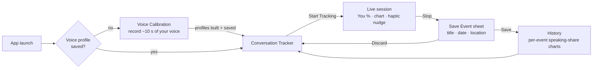
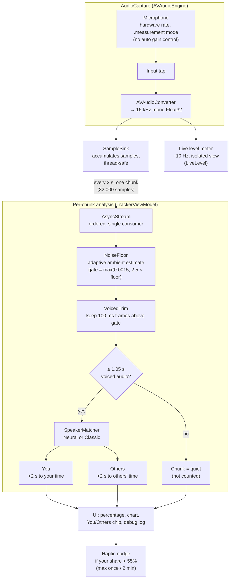
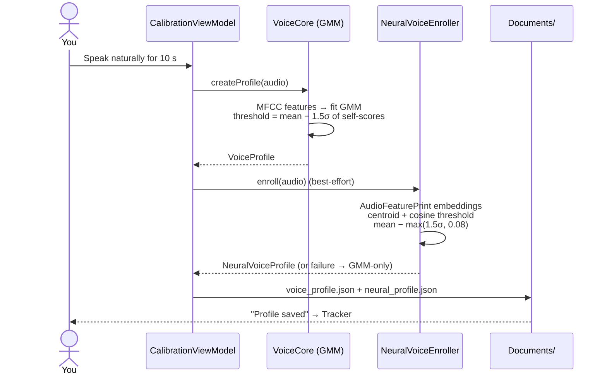
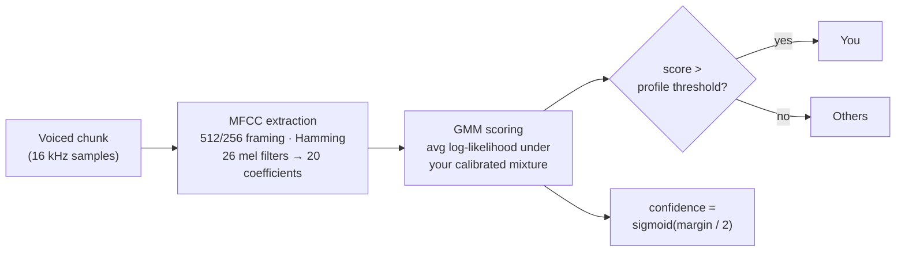
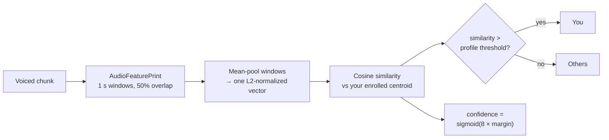
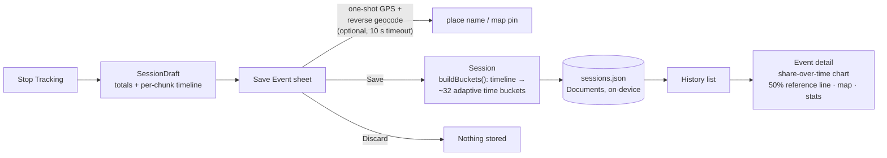
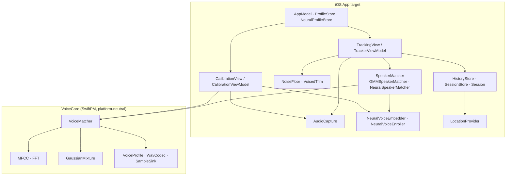

# Am I Talking Too Much? — How It Works

A friendly deep-dive into what the iOS app does, why, and how the pieces fit
together. Diagrams are [Mermaid](https://mermaid.js.org) and render directly on
GitHub.

---

## About: why letting others speak matters

We are reliably bad judges of our own airtime. Talking — especially about
ourselves — is neurologically rewarding, time flies while we do it, and memory
quietly inflates our sense of how balanced the conversation was. The research
paints a consistent picture:

- **Our memories overweight our own contributions.** In a classic study,
  spouses each estimated their share of household activities — the claimed
  shares routinely summed to well over 100%. We recall our own actions more
  easily than others', and our sense of "my share" inflates accordingly
  (Ross & Sicoly, 1979, *Journal of Personality and Social Psychology*).
- **Dominant speakers underestimate how much they talk.** Classroom-interaction
  research found teachers speaking roughly **two-thirds** of class time — far
  more than they believed they did (the "two-thirds rule"; Flanders, 1970,
  *Analyzing Teaching Behavior*). If trained communicators misjudge their own
  airtime that badly, the rest of us should not expect to do better at a
  dinner party.
- **Perception of who talks a lot is unreliable in general.** When researchers
  actually recorded people's daily speech instead of asking them, the
  long-standing stereotype that one gender talks far more than the other
  evaporated — both averaged around 16,000 words per day (Mehl et al., 2007,
  *Science*). Measurement beats impression.
- **Talking about ourselves is literally rewarding.** Self-disclosure engages
  the brain's mesolimbic dopamine (reward) system, and people in experiments
  even gave up small amounts of money for the chance to talk about themselves
  (Tamir & Mitchell, 2012, *PNAS*). Over-talking isn't a character flaw; it's
  a pull we all feel.
- **Listening wins people over.** Speed-dating and lab studies found that
  people who ask more questions — especially follow-up questions — are better
  liked, and question-askers earned more second dates (Huang, Yeomans, Brooks,
  Minson & Gino, 2017, *Journal of Personality and Social Psychology*).
- **Balanced airtime makes groups smarter.** A group's "collective
  intelligence" across many tasks was predicted not by its members' average IQ
  but by social sensitivity and **equality in conversational turn-taking**
  (Woolley et al., 2010, *Science*). Google's Project Aristotle reached a
  similar conclusion studying its own teams: on the best teams, members speak
  in roughly equal proportion.
- **Our listening defaults are worse than we think.** Studies of medical
  consultations found clinicians interrupt a patient's opening statement in
  seconds — a median of about 11 seconds in one recent study (Ospina et al.,
  2019, *Journal of General Internal Medicine*).

Put together: you probably talk more than you think, you can't feel it
happening, and the people around you notice even when you don't. This app
exists to replace that unreliable feeling with an on-device measurement — and
a gentle nudge while there's still time to pass the ball.

> References above are summarized from the published literature; double-check
> the originals before quoting figures formally.

---

## The big picture

Two phases: **calibrate once** (teach the app your voice, ~10 seconds), then
**track any conversation** (the app attributes each moment of speech to
You or Others, entirely on-device).

---

## The live audio pipeline

The heart of the app. Audio flows from the microphone to a per-chunk
You/Others decision about every 2 seconds.

Key design points:

- **Adaptive gate, not a fixed threshold.** `NoiseFloor` tracks the quietest
  recent chunks: it drops instantly when the room quiets and creeps up ~5% per
  chunk when it's loud. Speech must exceed ~2.5× the ambient level — so a
  quiet living room and a loud bar both work, and steady music doesn't count
  as conversation.
- **Only voiced audio is scored.** Chunks are cut on a clock, not on speech
  boundaries. `VoicedTrim` removes the silent parts before matching; a chunk
  with under ~1 s of actual voice is dropped rather than guessed at — for a
  share metric, discarding an ambiguous chunk is more honest than
  misattributing it.
- **Silence is never counted.** The headline percentage is *your share of the
  speaking time*, not of the elapsed time.

---

## Calibration: teaching the app your voice

One 10-second recording builds **two** independent voice profiles — so the two
matchers can be A/B-compared on the same enrollment.

Both profiles capture the same idea: *what does “you” sound like, and how far
from that can a 2-second chunk drift before it's someone else?* The threshold
leaves headroom (≈1.5 standard deviations) because short tracking chunks are
noisier than the calibration window.

---

## The two matchers

A shared protocol (`SpeakerMatcher`) hides which engine is running; a Settings
toggle flips between them mid-session without resetting your totals.

### Classic — MFCC + Gaussian Mixture Model (`VoiceCore`)

The same algorithm as the Python/Streamlit app, in a platform-neutral Swift
package with parity tests against fixtures generated from the Python code.

### Neural — AudioFeaturePrint embeddings (iOS only)

Uses Apple's pretrained on-device audio model (Create ML Components). Nothing
is downloaded and nothing leaves the phone.

Every decision is written to the on-screen **Debug Log** with its raw numbers
(`sim 0.912 thr 0.894` or `ll -18.3 thr -20.1`, plus RMS, the live gate, and
the voiced fraction) so mis-attributions can be diagnosed in the field, not
guessed at.

---

## Saving an event & the history

The per-event chart answers the question the live percentage can't: *when* in
the evening did you dominate, and when did you hand the conversation back.
Buckets adapt to event length (~32 buckets, minimum 15 s) so a 10-minute chat
and a 3-hour party both chart cleanly; buckets where nobody spoke render as
gaps, not zeros.

---

## What's stored, and where

Everything lives in the app's Documents folder on the phone. Nothing is
uploaded; no audio is ever persisted.

| File | Contents | Notes |
| --- | --- | --- |
| `voice_profile.json` | GMM voice profile | Same schema as the Python app — interchangeable |
| `neural_profile.json` | Embedding centroid + threshold | iOS only |
| `sessions.json` | Saved events: title, date, duration, optional location, speaking-share buckets | Metrics only — never audio |

Raw audio exists only transiently in memory (and as a per-chunk temporary file
during neural scoring, deleted immediately after embedding).

---

## Component map

`VoiceCore` has no Apple-framework dependencies — its 33 tests run on macOS or
Linux, and its math stays in lockstep with the Python app's `voice_matcher.py`
(fixtures regenerate via `ios/scripts/generate_fixtures.py`). Everything
Apple-specific (capture, Create ML, SwiftUI, location) lives in the app target.

---

## Glossary

- **RMS** — root-mean-square amplitude; "how loud is this audio."
- **MFCC** — mel-frequency cepstral coefficients; a compact spectral
  fingerprint of a slice of audio, long the standard feature for speech.
- **GMM** — Gaussian mixture model; models "the cloud of MFCC vectors your
  voice produces" so new audio can be scored by how well it fits.
- **Embedding** — a learned vector representation of audio from a neural
  network; similar sounds land near each other.
- **Cosine similarity** — how aligned two vectors are (1 = identical
  direction); used to compare a chunk's embedding to your enrolled centroid.
- **Chunk** — the 2-second unit of tracking; every chunk becomes You, Others,
  or quiet.
